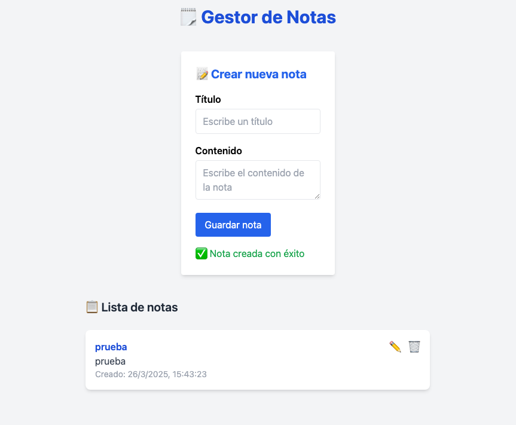
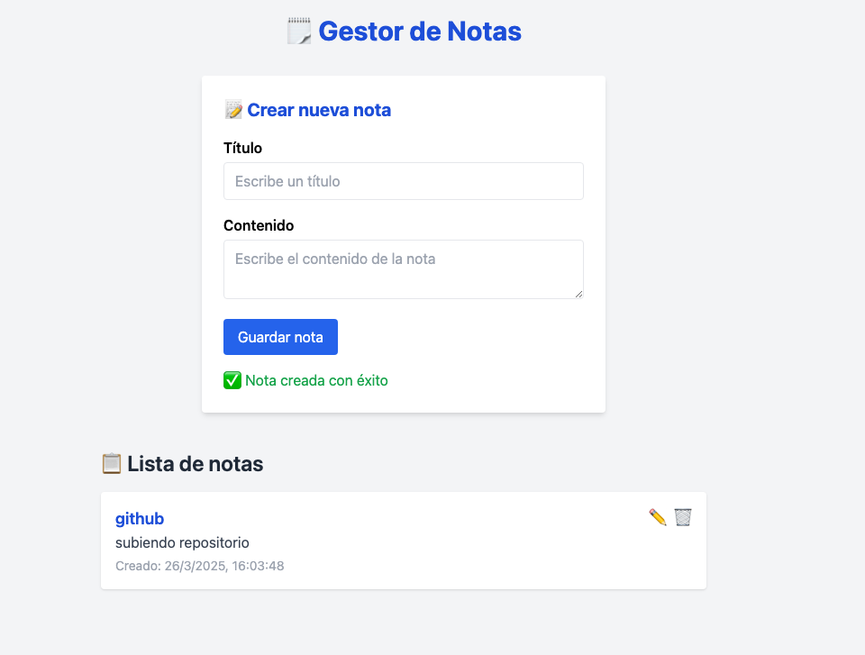

# Gestor de Notas


Un gestor de notas fullstack con operaciones CRUD, desarrollado con Laravel en el backend y Vue 3 con Tailwind CSS en el frontend.

## Capturas de pantalla

<div align="center">
  
  
</div>

## Características

- **Backend robusto** construido con Laravel
- **Frontend moderno** desarrollado con Vue 3
- **Diseño responsive** con Tailwind CSS
- **Operaciones CRUD completas** para gestión de notas
- **Interfaz intuitiva** y fácil de usar

## Demostración

### Crear Notas
- Añade títulos y contenido de manera sencilla
- Interfaz limpia y minimalista
- Confirmación inmediata de creación de nota

### Gestión de Notas
- Visualiza todas tus notas en una lista
- Edita o elimina notas con un solo clic
- Información de fecha de creación incluida

## Instalación

```bash
# Clonar el repositorio
git clone https://github.com/DevHashira/gestor-notas.git

# Entrar al directorio del proyecto
cd gestor-Notas

# Configurar backend (Laravel)
cd backend
composer install
cp .env.example .env
php artisan key:generate
php artisan migrate

# Configurar frontend (Vue 3)
cd ../frontend
npm install

# Iniciar servidores
# Terminal 1 (Backend)
php artisan serve

# Terminal 2 (Frontend)
npm run dev
```

## Requisitos

Para ejecutar este proyecto necesitarás:
1. PHP 8.1 o superior
2. Composer
3. Node.js 16+
4. MySQL
5. Git

## Tecnologías utilizadas

- **Backend**
  - Laravel 10
  - PHP
  - MySQL
  - Eloquent ORM

- **Frontend**
  - Vue 3
  - Tailwind CSS
  - Vite
  - JavaScript (ES6+)

## Estructura del proyecto

```
gestor-Notas/
├── backend/           # Directorio del proyecto Laravel
│   ├── app/           # Lógica de la aplicación
│   ├── database/      # Migraciones y seeders
│   └── routes/        # Definición de rutas API
│
├── frontend/          # Directorio del proyecto Vue
│   ├── src/           # Componentes y lógica Vue
│   ├── public/        # Recursos públicos
│   └── vite.config.js # Configuración de Vite
│
└── README.md          # Este archivo
```

## Configuración de Variables de Entorno

### Backend (.env)
```
APP_NAME=GestorNotas
DB_CONNECTION=mysql
DB_HOST=127.0.0.1
DB_PORT=3306
DB_DATABASE=gestor_notas
DB_USERNAME=tu_usuario
DB_PASSWORD=tu_contraseña
```

### Frontend (.env)
```
VITE_API_URL=http://localhost:8000/api
```

## Contribuciones

Las contribuciones son bienvenidas. Para contribuir:

1. Haz un fork del repositorio
2. Crea una rama para tu característica (`git checkout -b feature/nueva-caracteristica`)
3. Haz commit de tus cambios (`git commit -m 'Añadir nueva característica'`)
4. Haz push a la rama (`git push origin feature/nueva-caracteristica`)
5. Abre un Pull Request

## Roadmap

- [ ] Implementar autenticación de usuarios
- [ ] Añadir categorías para notas
- [ ] Búsqueda y filtrado de notas
- [ ] Modo oscuro
- [ ] Exportación de notas a PDF

## Licencia

Este proyecto está licenciado bajo la Licencia MIT.

## Contacto

[DevHashira 🥷💻](https://github.com/DevHashira)

---

Desarrollado con ❤️ por [DevHashira 🥷💻]